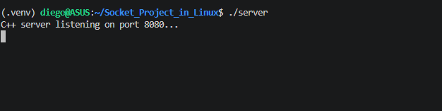
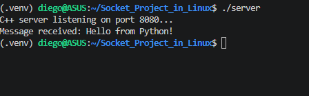
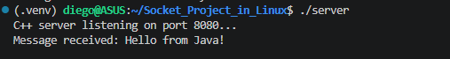

# Socket Project on Linux

## 1. Server in C++ (server.cpp)
C++ was chosen for the server due to its high efficiency and direct access to the Linux socket API (sys/socket.h).

Socket Creation: The `socket()` function is used to define the communication point on the server.

Bind & Listen: `bind()` is used to assign an IP address and port within the system, and `listen()` puts the server into waiting mode when the file is run in the terminal.

Accept: The `accept()` function was used because it blocks the program until a client attempts to connect, in this case, a Python or Java user, creating a new file descriptor for that specific connection.

This was used to ensure low latency and robust network thread management.

## 2. Client in Python (customer.py)
Python was used for its simplicity in handling data streams and strings.

Socket Library: This library is used to quickly create the socket object.

Connect: Connects directly to the server's IP address in C++ and the defined port.

Send/Receive: Uses `sendall()` and `recv()` to exchange messages.

This was used to demonstrate that a network service can be consumed in a simple and readable way.

## 3. Java Client (customer_2.java)
Java was used to demonstrate interoperability between different ecosystems within the server.

Socket Class: Instantiated to initiate the TCP connection.

Streams: Uses `Streams` and `PrintWriter` to send data and `BufferedReader` to read the server's response in C++.

Try-with-resources: Implemented this function to ensure that sockets are automatically closed upon termination, preventing memory leaks.

This was used to validate that a C++ server can communicate with high-level languages ​​running on a Java Virtual Machine (JVM).

## What I learned

This project taught me that programming languages ​​can communicate with each other to send messages, as was the case here. I was able to set up a mini "Server" with C++ and communicate with it from Python and Java in the terminal by opening port 8080.

